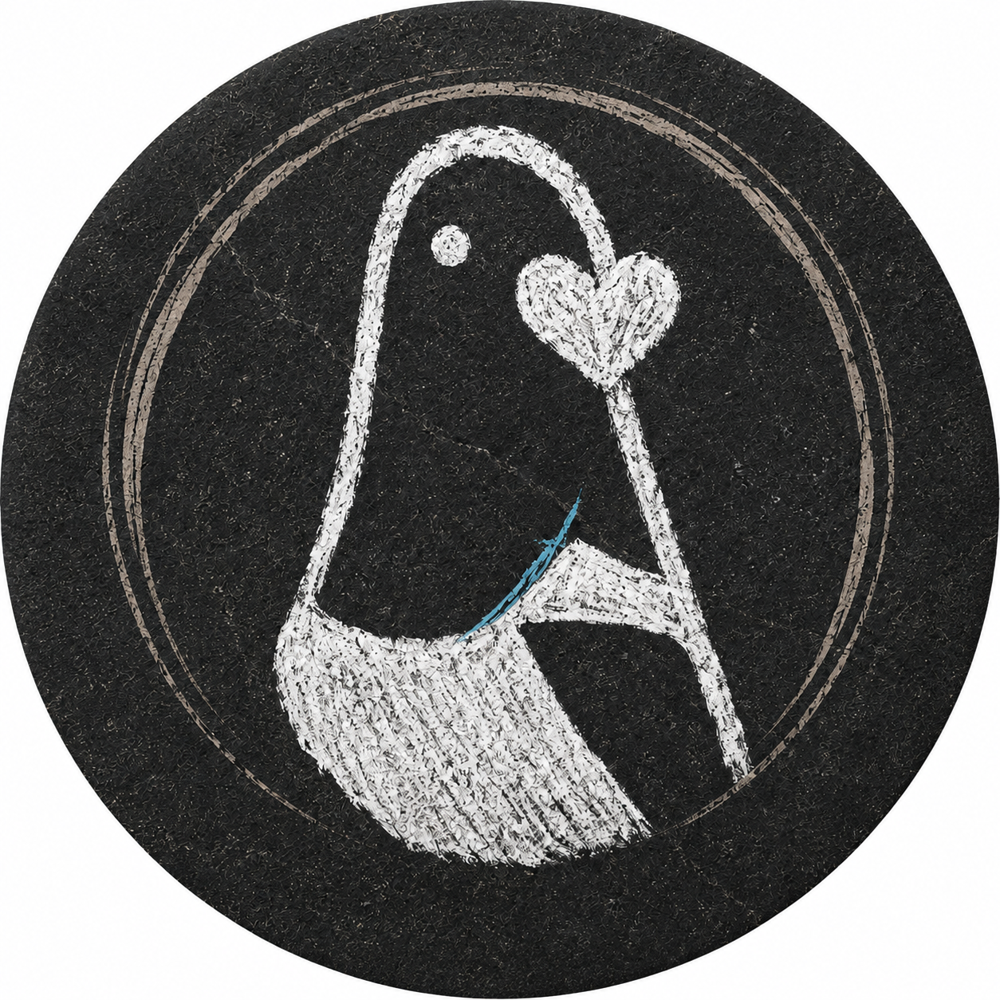

<div align="center">

<h1>La Musica</h1>
<p><strong>Music, but ours.</strong> A FOSS Spotify + YouTube Music client — born in an Italian Telegram channel.</p>

[](LICENSE)
[](#principles)
[](#the-story)
</div>

---

**La Musica** is a fork of [Meld](https://github.com/FrancescoGrazioso/Meld) by Francesco Grazioso — a music player that manages your library, playlists and the Spotify algorithm, using media from YouTube Music. We maintain it as a *daily driver*: fast, honest, and fully under your control. No trackers, no dark patterns, no features you didn't ask for.

## The story

Meld started in an Italian Telegram channel as a way to keep enjoying the Spotify experience without depending on Spotify's goodwill. When a potential cease-and-desist from Spotify came up in conversation, one question surfaced: *what happens to your library, playlists and algorithm if the plug gets pulled?*

The answer is independence: **ListenBrainz support** — scrobbling and library data that live where *you* decide, not where a platform allows. This fork carries that idea end-to-end: token injection, provider selection, and a settings UI, wired into the player itself.

> "It's FOSS. It's Italian. Let's see if it can handle la musica."

The logo is drawn **by hand** — stone on stone, literally — in honor of **Narcio**, of his personal sub-lore, and of the **OT** Telegram group that made all of this happen. If you know, you know. 🇮🇹

## What's different from Meld

- 🧠 **ListenBrainz end-to-end** — scrobble to your own instance, own your listening history
- 🎚️ **DSP loudness chain** — loudness-normalized gain with anti-click ramping and a true-peak soft-clip limiter; volume normalization that sounds clean, not crushed
- 🖤 **pureBlack OLED theme** as default — real black, real battery savings on AMOLED
- 🛠️ **Maintenance-first** — upstream syncs, build fixes, strict no-bloat policy

## Principles

1. **Your data is yours** — ListenBrainz/FOSS alternatives over platform lock-in
2. **Honesty over hype** — every feature does what it says, nothing phones home
3. **User control** — every optional behavior has a switch; defaults are conservative
4. **Community-driven** — born from a Telegram channel, shaped by the people who use it daily

## Building

```bash
git clone https://github.com/Chande9/la-musica-public.git
cd la-musica-public
git submodule update --init metroproto
export PATH="/path/to/protoc/bin:$PATH"   # protobuf compiler, v29.x
cd app && bash generate_proto.sh && cd ..
./gradlew assembleFossDebug
```

Output: `app/build/outputs/apk/foss/debug/`

## Credits

- **[Meld](https://github.com/FrancescoGrazioso/Meld)** by Francesco Grazioso — the foundation, and the original vision
- **[Metrolist](https://github.com/mostafaalagamy/Metrolist)** and the YouTube Music client community — upstream lineage
- The Italian Telegram channel that started it all — and everyone who said *"let me cook"*
- The icon/logo is a hand-drawn sketch — made in honor of Narcio and his personal sub-lore, and of the OT group

## License

GPL-3.0 — same as the upstream project. Fork freely, contribute back.